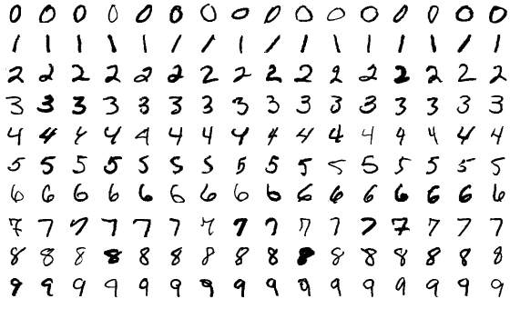
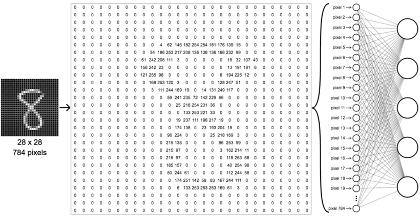

## Neural Network with PyTorch

Small Neural Network that trains a MNIST database of handwritten digits, has a training set of 60,000 examples, and a test set of 10,000 examples. The digits have been size-normalized and centered in a fixed-size 

<center>

###### MNIST Dataset example


###### (28x28)px - 784 nodes with a nomalized value of 0.0 = #000000(black) and 1.0 = #FFFFFF(white)

</center>

---

###### The script will automatically download the dataset if not in the folder yet

```
Downloading http://yann.lecun.com/exdb/mnist/train-images-idx3-ubyte.gz
Downloading http://yann.lecun.com/exdb/mnist/train-images-idx3-ubyte.gz to dataset/MNIST...
100%|██████████████████████████████████████████████████| 9912422/9912422 [00:04<00:00, 23...
Extracting dataset/MNIST/raw/train-images-idx3-ubyte.gz to dataset/MNIST/raw

Downloading http://yann.lecun.com/exdb/mnist/train-labels-idx1-ubyte.gz
Downloading http://yann.lecun.com/exdb/mnist/train-labels-idx1-ubyte.gz to dataset/MNIST...
100%|██████████████████████████████████████████████████████| 28881/28881 [00:00<00:00, 25...
Extracting dataset/MNIST/raw/train-labels-idx1-ubyte.gz to dataset/MNIST/raw
...
```

---
###### Accuracy Outputsa tests

<Table><td>

```python
** Neural Network Initialized **
Training data... batch size:32 epochs:2
...
Checking accuracy on training data 
Got 57297/60000 with accuracy of 95.49% 
# Elapsed time: 41.66 sec
```
```python
** Neural Network Initialized ** 
Training data... batch size:64 epochs:2
...
Checking accuracy on training data 
Got 57109/60000 with accuracy of 95.18% 
# Elapsed time: 30.03 sec
```
```python
** Neural Network Initialized ** 
Training data... batch size:128 epochs:2
...
Checking accuracy on training data 
Got 56696/60000 with accuracy of 94.49% 
# Elapsed time: 25.10 sec
```
</td><td>

```python
** Neural Network Initialized ** 
Training data... batch size:32 epochs:5
...
Checking accuracy on training data 
Got 58765/60000 with accuracy of 97.94% 
# Elapsed time: 97.55 sec
```
```python
** Neural Network Initialized ** 
Training data... batch size:64 epochs:5
...
Checking accuracy on training data 
Got 58268/60000 with accuracy of 97.11% 
# Elapsed time: 75.11 sec
```
```python
** Neural Network Initialized ** 
Training data... batch size:128 epochs:5
...
Checking accuracy on training data 
Got 58010/60000 with accuracy of 96.68% 
# Elapsed time: 60.33 sec
```
</td></Table>